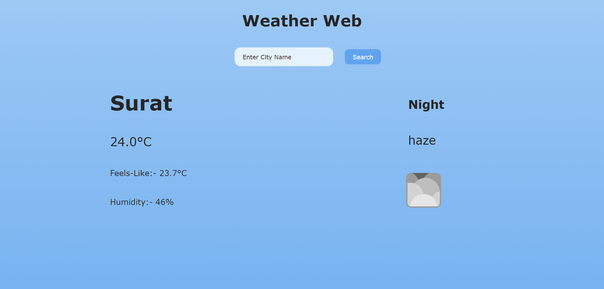
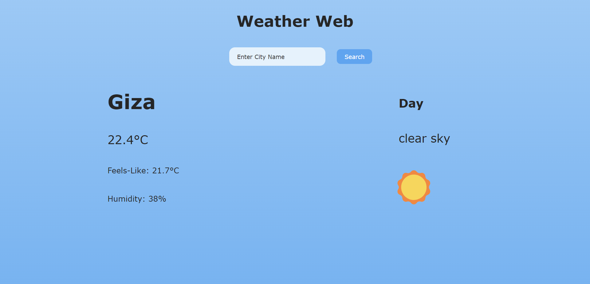
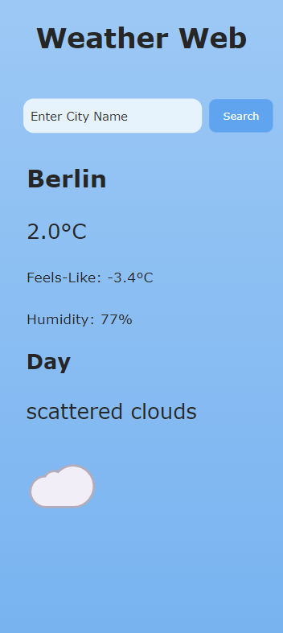

# Weather Web

Make Weather application using javascript

**How to Run:-**

1. First go to [Open Weather Map](https://openweathermap.org/) Website.
2. then Create accound and get API.
3. add api to javascript file

```javascript
const apiKey = "Enter Your API key Here";
```

**Features:-**

- See Humidity and feel like temprature
- A different symbol appears when there is different weather
- Dynamic and Responsive
- also mobile friendly view is supported

## Screenshots of App




